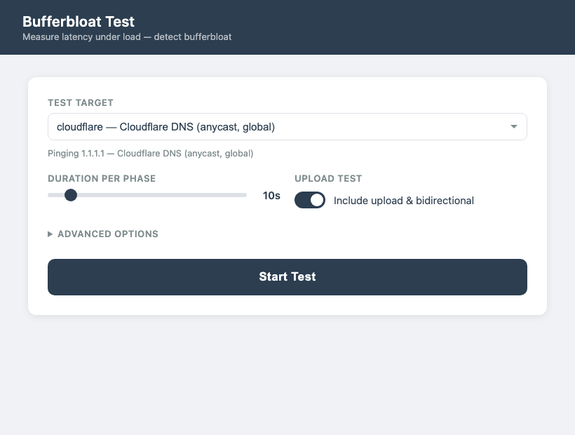

# bufferbloat.py

A command-line tool that measures **bufferbloat** — the latency spike your connection experiences when it's under load — and generates a self-contained HTML or PDF report with graphs.

## Web GUI



Launch with `python3 bufferbloat.py --gui` — opens automatically in your browser.

## What is bufferbloat?

Bufferbloat happens when your router or modem has an oversized queue. Under load (downloading, uploading, or both), packets sit in that queue instead of being dropped or managed, causing latency to spike from a few ms to hundreds of ms. This kills video calls, gaming, and interactive traffic while someone else on the network is doing a large transfer.

This tool measures it by pinging a target once per second while simultaneously saturating your connection with HTTP load, then comparing idle vs. loaded latency.

## Grading

| Grade | Bloat (extra latency under load) |
|-------|----------------------------------|
| A     | < 5 ms                           |
| B     | 5 – 30 ms                        |
| C     | 30 – 60 ms                       |
| D     | 60 – 200 ms                      |
| F     | > 200 ms                         |

## Requirements

```bash
pip install matplotlib
pip install weasyprint  # optional, only needed for PDF output
```

Python 3.6+ required. Works on macOS and Linux.

## Usage

```bash
# Basic test, saves report.html in current directory
python3 bufferbloat.py

# Choose a preset target
python3 bufferbloat.py --target cloudflare
python3 bufferbloat.py --target istanbul

# See all available preset targets
python3 bufferbloat.py --list-targets

# Save as PDF
python3 bufferbloat.py --output report.pdf

# Longer phases for more data points
python3 bufferbloat.py --duration 20

# Skip upload test (some corporate networks block outbound POST)
python3 bufferbloat.py --no-upload

# Use a custom ping host
python3 bufferbloat.py --ping-host 192.168.1.1

# Verbose: print every RTT as it's collected
python3 bufferbloat.py --verbose
```

## Options

| Option | Default | Description |
|--------|---------|-------------|
| `--output FILE` | `report.html` | Output path; use `.pdf` extension for PDF |
| `--duration N` | `10` | Seconds per test phase |
| `--target NAME` | — | Preset target (see `--list-targets`) |
| `--ping-host HOST` | `8.8.8.8` | Custom ping host (overrides `--target`) |
| `--list-targets` | — | Print all preset targets and exit |
| `--no-upload` | — | Skip upload and bidirectional phases |
| `--verbose` | — | Print each RTT value live |

## Test phases

1. **Baseline** — idle latency, no load
2. **Download** — latency while saturating download
3. **Upload** — latency while saturating upload
4. **Bidirectional** — latency under simultaneous download + upload
5. **Recovery** — latency after load stops (how fast the queue drains)

## Preset targets

```
Global:           cloudflare, google, quad9, opendns
Western Europe:   amsterdam, frankfurt, london, paris, madrid, milan, zurich, lisbon, brussels
Northern Europe:  stockholm, helsinki, oslo, copenhagen
Eastern Europe:   warsaw, prague, vienna, budapest, sofia, bucharest
Turkey:           istanbul, ist-ix
Middle East:      dubai
North America:    newyork, ashburn
Asia Pacific:     singapore, tokyo, sydney
```

Use `--list-targets` to see IP addresses and descriptions.

## Report output

The HTML report is fully self-contained (no external dependencies, works offline):

- Overall grade with color coding
- Per-phase results table (min / median / P90 / max / packet loss% / ↓ Mbps / ↑ Mbps / bloat / grade)
- Latency over time line chart with phase boundaries
- RTT distribution box plots per phase
- Throughput bar chart (download and upload Mbps per phase)
- Plain-English interpretation of results

## How load is generated

Load is generated using parallel HTTP connections (pure Python, no iperf3 required):
- **Download**: 4 threads streaming a 100 MB file from a public server
- **Upload**: 4 threads POSTing random data chunks

This is enough to saturate most consumer connections. For multi-gigabit links, results may understate bloat.

## Fixing bufferbloat

If you score C or worse:

- **Enable SQM / AQM on your router** — look for CAKE or fq_codel in your router settings
- **OpenWrt** has `luci-app-sqm` — highly recommended
- **OPNsense / pfSense** both support HFSC + fq_codel under Traffic Shaper
- **Consumer routers**: check if your ISP modem/router has a "QoS" setting; results vary widely
- **If you can't touch the router**: reducing the number of parallel upload threads helps, but doesn't fix the root cause

## License

MIT
